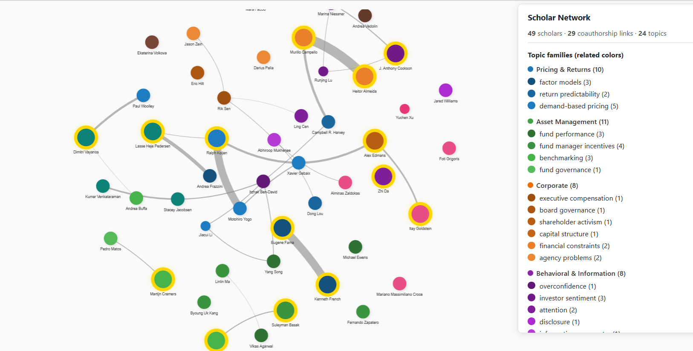

# Obsidian Scholar Network

> 用 Obsidian 搭建一张可交互的学术合作网络——看清谁在定义一个研究主题、谁和谁紧密合作、谁是连接不同社群的桥梁。



这不是一个 Obsidian 插件，也不是一键安装的工具。它是一套 **方法论 + 启动套件**：模板、AI 处理 prompt、Dataview 查询、可视化脚本——你可以直接拿来用，也可以迁移到任何学科。

---

## 为什么需要学者关系网

只管理论文，你只看到了一半的图景。论文告诉你「什么被研究过」；学者关系网告诉你「谁在做这些研究、他们之间是什么关系」。

具体来说，学者关系网帮你回答这些问题：

- **谁是某个主题的 gatekeeper？** 比如你在写一篇 return predictability 的论文，谁的工作是绕不开的？谁很可能出现在审稿人名单上？
- **一个研究社群是紧密还是松散的？** 如果一个主题下只有 5 个学者但彼此合作频繁（tight-knit cluster），说明进入门槛高但一旦进入就有合作机会；如果人多但各做各的（fragmented），说明新人容易切入但审稿会更不友好。
- **谁是跨主题的桥梁？** 有些学者同时活跃在两个方向——他们是连接不同学术社群的关键人物，往往也是开会时最值得交流的对象。
- **见面之前了解对方的合作图谱。** 知道一个学者最常合作的人是谁、最近在做什么方向，能让你的会议对话有的放矢。

**文献库回答「有哪些论文」，学者关系网回答「有哪些人、他们怎么连在一起」。初步了解一个领域时，从某位知名学者开始快速搭建一个学者关系网会很有帮助**

---

## 整体流程

```
学者 Google Scholar 页面 ──► Web Clipper ──► Clippings/scholarname.md
                                                     │
                                                     ▼
                              任意 AI + Scholar-profiler.md prompt
                                                     │
                                                     ▼
                                           Scholars/学者姓名.md
                                                     │
                                                     ▼
                           python scholar_network.py ──► 可交互 HTML 网络图
```

1. **剪藏** — 用 Obsidian Web Clipper 把学者的 Google Scholar / ORCID / 个人主页保存为 Markdown
2. **AI 处理** — 把剪藏和 `Scholar-profiler.md` 一起交给任意 AI，让它解析论文列表、统计合作者、分配主题、生成结构化学者笔记
3. **存入 vault** — 把 AI 输出的笔记放到 `Scholars/` 文件夹，你审核并补充 Notes 部分
4. **可视化** — 运行 Python 脚本，生成一张可拖拽、可缩放、鼠标悬停看详情的交互式网络图

每新增一个学者就重复步骤 1–3。积累 5 个以上之后，跑一次脚本就能看到 cluster 开始涌现。

---

## 快速开始（大约 30 分钟）

### 你需要准备

| 工具 | 用途 | 必须？ |
|------|------|--------|
| [Obsidian](https://obsidian.md/) | 笔记环境 | 是 |
| [Dataview](https://github.com/blacksmithgu/obsidian-dataview) 插件 | 驱动 Dashboard 查询 | 是 |
| [Obsidian Web Clipper](https://obsidian.md/clipper) | 剪藏学者网页 | 是 |
| [Python 3.10+](https://www.python.org/) | 运行可视化脚本 | 是 |
| 任意 AI（ChatGPT / Claude / Gemini 等） | 处理剪藏、生成学者笔记 | 是 |
| [Templater](https://github.com/SilasKnobel/Templater) 插件 | 模板里自动填日期 | 可选 |

### 第一步：把启动文件复制到你的 vault

把 `vault-starter/` 下的三个文件夹复制到你的 Obsidian vault：

```
vault-starter/Scholars/     →  你的vault/Scholars/
vault-starter/Templates/    →  你的vault/Templates/
vault-starter/Agent Prompt/ →  你的vault/Agent Prompt/
```

复制完成后你会得到：
- `Scholars/_Scholar Network.md` — Dataview 仪表盘，开箱即用
- `Scholars/_Scholar Topic Vocabulary.md` — 主题词汇表（需要你自定义）
- `Scholars/_Topic Maps/` — 空文件夹，等积累到一定数量后再建 Topic Map
- `Templates/Scholar Template.md` — Templater 版学者模板
- `Templates/Scholar Template (plain).md` — 不用 Templater 的纯 Markdown 版本
- `Agent Prompt/Scholar-profiler.md` — AI 处理规则 prompt

### 第二步：自定义主题词汇表

打开 `Scholars/_Scholar Topic Vocabulary.md`。默认内容是一份 **金融经济学** 的词汇表——如果你做的是其他学科，把 topic 换成你自己的。但要 **保留结构**：

- `###` 标题定义 **broad family**（如 `### Pricing & Returns`）
- 每行表格定义一个合法的 topic

为什么结构很重要？因为词汇表不只是标签清单——它是整个可视化的**语义层**。同一个 family 下的 topic 会自动获得相近的颜色，在网络布局中也会保持在相近的区域。

> 举个例子：`factor models`、`return predictability`、`demand-based pricing` 都属于 `Pricing & Returns` 这个 family。在网络图中，它们会共用蓝色系（不同深浅），并且被弱连接拉到相近的位置——但真正决定布局骨架的仍然是合作关系（coauthorship edge），不是强行按颜色堆到一起。

### 第三步：创建你的第一个学者笔记

这是系统真正开始运转的一步。

1. **剪藏一个学者页面。** 打开某位学者的 Google Scholar 主页（或 ORCID、个人网站），用 Obsidian Web Clipper 保存。剪藏会自动存入你的 `Clippings/` 文件夹。

2. **丢给 AI 处理。** 把剪藏内容和 `Agent Prompt/Scholar-profiler.md` 一起发给你常用的 AI，然后说：

   > "根据 Scholar-profiler.md 的规则，从这份剪藏生成一个学者 profile。"

   AI 会完成以下工作：
   - 解析所有论文和合作者
   - 去重（Google Scholar 经常重复列出同一篇论文的不同版本）
   - 按合作论文数量排名，保留 top 20 coauthors
   - 从你的词汇表中选 1–3 个 `primary_topics`
   - 判断 role（gatekeeper / active / emerging / peripheral）
   - 选 5 篇代表作
   - 撰写简要 Profile 和 Notes

3. **保存到 `Scholars/Full Name.md`。** 检查 AI 的输出——提取论文和统计合作者这些繁琐工作 AI 做得很好，但主题分配是否准确、role 是否合理、Notes 里关于你自己研究关联的判断——只有你能做。

4. **查看 Dashboard。** 打开 `Scholars/_Scholar Network.md`，Dataview 查询会自动更新，你应该能看到新增的学者出现在各个表格中。

> **不需要追求完美。** 很多学者笔记一开始只是 stub——有名字、有 topic、有几个 coauthor 就够了。随着你读更多论文、参加更多会议，细节会自然填充。wikilink 的妙处在于，即使链接指向的笔记还不存在，它已经在图中创建了一个 placeholder node。

### 第四步：积累学者、生成网络图

重复第三步，多处理几位学者。积累到 5 个以上后，生成可视化：

```bash
# 安装依赖（只需一次）
pip install -r scripts/requirements.txt

# 生成网络图
python scripts/scholar_network.py --vault-root /path/to/your/vault
```

脚本会在 `Scholars/` 下生成 `scholar_network.html`，用浏览器打开即可探索。

这个仓库 **不提供可直接运行的 demo scholar 数据集**。你需要在自己 vault 的 `Scholars/` 文件夹里创建学者笔记；`examples/` 文件夹只用于参考示例，不会被默认当作数据源读取。

也可以指定输出路径：

```bash
python scripts/scholar_network.py --vault-root /path/to/your/vault --output ~/Desktop/network.html
```

每次新增或更新学者笔记后重新运行脚本即可刷新网络图。

---

## 核心设计逻辑

### 为什么用 topic 而不是 field

说一个学者做「asset pricing」几乎没有信息量——asset pricing 下面有 factor models、anomalies、liquidity、demand-based pricing 等几十个方向，各有各的研究圈子。

**主题（topic）才是学者身份的标签。** 提到 investor attention 你会想到 Zhi Da，提到 corporate culture 你会想到 Kai Li——这些关联发生在主题级别，不是领域级别。同时保留 `fields` 作为辅助元数据，可以和文献库交叉引用。

### 为什么用 coauthorship 而不是 citation

引用太弱了——你可以引用一个从没说过话的人。合作关系强得多：两个人愿意在同一篇论文上署名，说明他们真的在同一个圈子里。Coauthorship 是 community mapping 最有信息量的信号。

### 词汇表不只是标签清单

`_Scholar Topic Vocabulary.md` 同时承担三层功能：

1. **控制合法性** — `primary_topics` 必须从这里选，防止 tag 爆炸
2. **定义 family** — `###` 标题把 topic 组织成 broad family
3. **驱动可视化** — 同一 family 下的 topic 自动获得相近色系，布局中也会更靠近

具体来说：`factor models`、`return predictability`、`demand-based pricing` 都属于 `Pricing & Returns`。在网络图中：

- 它们共享**蓝色系**——不同深浅，但一眼看出是一家人
- 它们之间有**弱 hidden links**，让相关 cluster 保持在相近区域
- 但**骨架仍然是 coauthorship**——真实合作关系才是布局的决定性力量

想指定某个 family 的颜色？在标题上加标记即可：

```md
### Pricing & Returns {color=#1F77B4}
```

### Gatekeeper 要谨慎

Gatekeeper 不是发了几篇好文章就能标的。真正的 gatekeeper 是他的名字和这个主题画等号的那种——提到 factor models 你绕不开 Eugene Fama，提到 attention 你绕不开 Zhi Da。宁可少标，不要滥标。默认标 `active`，只有证据充分时才升级为 `gatekeeper`。

---

## 示例学者笔记

`examples/` 文件夹包含真实的学者笔记，展示不同类型的用法：

| 示例 | 说明 |
|------|------|
| [Eugene Fama](examples/Eugene%20Fama.md) | **Gatekeeper** — 金融学引用最高的学者，展示完整的 profile 和详细 notes |
| [Kenneth French](examples/Kenneth%20French.md) | **Stub** — 最简化的笔记，只有名字和一个 coauthor，但已经是网络图中的有效节点 |
| [Kumar Venkataraman](examples/Kumar%20Venkataraman.md) | **Active scholar** — 丰富的 coauthor 结构，展示一个真实的研究 cluster |
| [Stacey Jacobsen](examples/Stacey%20Jacobsen.md) | **Cross-topic bridge** — 同时跨越 market microstructure 和 corporate finance |

这些示例仅供参考。可视化脚本不会读取它们，除非你把它们复制到你自己 vault 的 `Scholars/` 文件夹。

---

## Dashboard 能看到什么

在 vault 中有了几个学者笔记之后，`_Scholar Network.md` 会通过 Dataview 自动生成以下视图：

- **主题全景** — 每个 topic 有多少学者、多少 gatekeeper、合作紧密度如何
- **Gatekeeper 名录** — 所有被标为 gatekeeper 的学者及其主题、机构
- **最高连接度学者** — 按追踪的 coauthor 数量排名
- **Cross-topic 桥梁** — `primary_topics` 跨越两个或更多方向的学者
- **合作链接表** — 谁和谁有 wikilink 连接
- **Stub 学者（待完善）** — 需要补充 profile 的笔记
- **最近更新** — 最近修改的 10 个学者笔记

全部自动更新，不需要手动维护。

---

## 仓库结构

```text
obsidian-scholar-network/
├── README.md                        # 英文文档
├── README_CN.md                     # 本文件
├── LICENSE                          # MIT
│
├── vault-starter/                   # 复制到你的 vault
│   ├── Scholars/
│   │   ├── _Scholar Network.md      # Dataview 仪表盘
│   │   ├── _Scholar Topic Vocabulary.md  # 主题词汇表（需自定义）
│   │   └── _Topic Maps/             # 主题索引笔记（初始为空）
│   ├── Templates/
│   │   ├── Scholar Template.md      # Templater 版
│   │   └── Scholar Template (plain).md  # 纯 Markdown 版
│   └── Agent Prompt/
│       └── Scholar-profiler.md      # AI 处理 prompt
│
├── scripts/
│   ├── scholar_network.py           # 可视化脚本
│   └── requirements.txt             # networkx, pyvis, pyyaml
│
├── examples/                        # 真实学者笔记示例
│   ├── Eugene Fama.md               # Gatekeeper 范例
│   ├── Kenneth French.md            # Stub 范例
│   ├── Kumar Venkataraman.md        # Active scholar 范例
│   └── Stacey Jacobsen.md          # Cross-topic bridge 范例
│
├── screenshots/                     # 截图
└── docs/
    ├── customization.md             # 迁移到其他领域的指南（英文）
    └── customization_CN.md          # 迁移到其他领域的指南（中文）
```

---

## 定制化

更多定制说明见：

- [docs/customization_CN.md](docs/customization_CN.md)（中文）
- [docs/customization.md](docs/customization.md)（英文）

内容包括：

- 把金融词汇表替换为你自己的学科
- 选择合适的 topic 粒度
- 控制 family 颜色（自动分配或手动指定）
- 调整 topic 和 family 的聚类强度
- 修改 Scholar Profiler prompt 以适配新领域
- 修改节点大小和 tooltip 内容

---

## License

MIT
